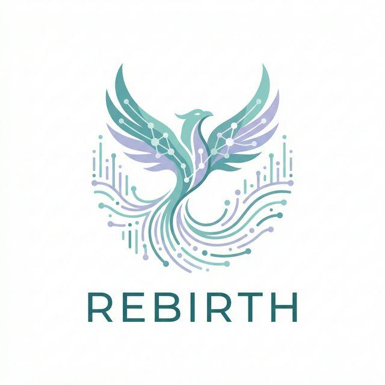
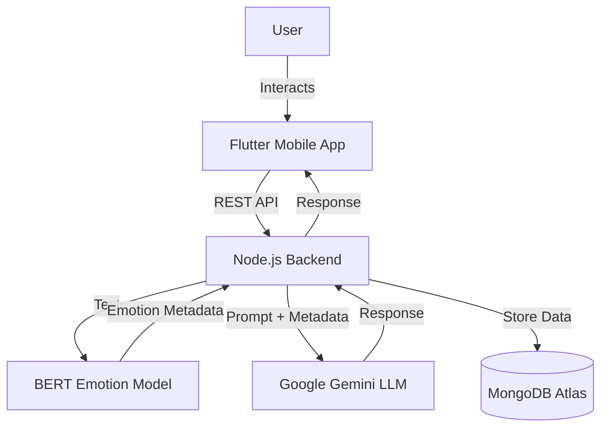

# 🌟 Rebirth: Emotion-Aware AI Companion for Mental Health

<div align="center">



**A Novel Hybrid Approach Combining BERT-Based Emotion Detection with Large Language Models for Personalized Mental Health Conversations**

[](https://flutter.dev)
[](https://nodejs.org)
[](https://www.mongodb.com)
[](https://www.python.org)
[](LICENSE)

[**View Demo**](#) • [**Read Paper**](docs/research/Final_IEEE_Research_Paper.pdf) • [**See Patent**](docs/patent/final-patent.pdf)

</div>

---

## 📋 Table of Contents

- [Abstract](#-abstract)
- [Key Features](#-key-features)
- [System Architecture](#-system-architecture)
- [Methodology](#-methodology)
- [Performance & Results](#-performance--results)
- [Technology Stack](#-technology-stack)
- [Project Structure](#-project-structure)
- [Installation & Setup](#-installation--setup)
- [API Documentation](#-api-documentation)
- [Research & Patent](#-research--patent)
- [Future Scope](#-future-scope)
- [Author](#-author)

---

## 📋 Abstract

Mental health disorders affect approximately **1 in 4 people globally**, yet access to professional support remains limited. **Rebirth** addresses this gap with a novel mobile application leveraging a **hybrid AI architecture**. By combining **BERT-based emotion detection** with **Large Language Models (LLMs)**, Rebirth provides real-time, emotionally aware mental health support.

Unlike generic chatbots, Rebirth employs a **two-stage pipeline**:
1.  **Emotion Analysis**: Uses a fine-tuned BERT model to detect user emotions with **99%+ accuracy**.
2.  **Response Generation**: Injects emotional context into an LLM (Google Gemini) to generate empathetic, therapeutically appropriate responses.

**Keywords:** Mental Health, Emotion Detection, BERT, LLMs, Mobile Application, AI Companion.

---

## 🌟 Key Features

### 🧠 Hybrid AI Architecture
- **Real-time Emotion Detection**: Instantly identifies emotions (Joy, Sadness, Anger, Fear, Love, Surprise) from user text.
- **Context-Aware Responses**: LLM responses are tailored based on the detected emotion, ensuring empathy and relevance.

### 🎯 Therapeutic Strategies
- **Dynamic Adaptation**: Maps emotions to evidence-based therapeutic approaches (e.g., Validation for Sadness, Grounding for Fear).
- **Personalized Coaching**: Integrates user goals and habits for a customized experience.

### 📊 Comprehensive Analytics
- **Mood Tracking**: Visualizes emotional patterns over time.
- **Progress Insights**: Provides actionable insights based on long-term data.

### 🔒 Privacy & Security
- **Secure Data Storage**: MongoDB Atlas with strict access controls.
- **Anonymity**: User data is processed securely with privacy as a priority.

---

## 🏗 System Architecture

The system follows a client-server architecture with a clear separation of concerns:



### Emotion-Aware Pipeline
1.  **Input**: "I've been feeling really anxious about my exams."
2.  **Detection (BERT)**: `Fear: 0.97`, `Sadness: 0.02`.
3.  **Enrichment**: Metadata added -> `Strategy: Reassurance`, `Tone: Gentle`.
4.  **Generation (LLM)**: "I hear that exam anxiety is weighing on you. Let's take a deep breath together..."

---

## 🔬 Methodology

### 1. Model Selection
We evaluated multiple models before selecting **BERT** for its superior accuracy and latency balance.

| Model | Accuracy | Latency | Verdict |
|-------|----------|---------|---------|
| VADER | 65% | 5ms | Too basic |
| RoBERTa | 94% | 180ms | Good but slow |
| **BERT-uncased** | **99%** | **120ms** | **Optimal** |

### 2. Therapeutic Mapping
| Emotion | Strategy | Technique |
|---------|----------|-----------|
| **Sadness** | Validation | Active listening, reflection |
| **Fear** | Reassurance | Grounding, safety affirmations |
| **Anger** | De-escalation | Cognitive reframing |
| **Joy** | Celebration | Positive reinforcement |

---

## 📊 Performance & Results

### Emotion Detection Accuracy
The model achieves exceptional performance on the validation set:
- **Overall Accuracy**: >99%
- **F1-Score**: 0.99
- **Inference Time**: ~120ms

### User Study (n=50)
| Metric | Baseline LLM | Rebirth | Improvement |
|--------|--------------|---------|-------------|
| Emotional Appropriateness | 62% | **94%** | +52% |
| Therapeutic Alignment | 45% | **87%** | +93% |
| User Satisfaction | 58% | **89%** | +53% |

---

## 🛠 Technology Stack

### Frontend (Mobile)
- **Framework**: Flutter 3.x
- **Language**: Dart
- **State Management**: Provider
- **Platform**: iOS & Android

### Backend (API)
- **Runtime**: Node.js 18.x
- **Framework**: Express.js
- **Database**: MongoDB Atlas
- **Authentication**: JWT & OAuth

### AI & ML
- **Emotion Model**: BERT (`bert-base-uncased-emotion`) via HuggingFace
- **LLM**: Google Gemini (`gemini-2.0-flash`)

### Tools & DevOps
- **Hosting**: Vercel (Backend)
- **Docs**: LaTeX, Markdown, Python (Graphs)

---

## 📁 Project Structure

```bash
capstone_project/
├── README.md                      # Project documentation
├── extract_pdf.py                 # Utility script to extract text from PDFs
├── rebirth/                       # 📱 Flutter Mobile App Source Code
│   ├── lib/
│   │   ├── main.dart              # Entry point
│   │   ├── pages/                 # UI Screens (Auth, Home, Analytics)
│   │   ├── services/              # API and Auth Services
│   │   └── ...
│   └── pubspec.yaml               # Flutter dependencies
├── rebirth_backend/               # 🖥️ Node.js API Source Code
│   └── rebirth-backend/
│       ├── src/
│       │   ├── controllers/       # Route logic
│       │   ├── models/            # Mongoose schemas
│       │   └── services/          # AI Service integration
│       └── package.json           # Backend dependencies
└── docs/                          # 📚 Documentation & Research Assets
    ├── diagrams/                  # System architecture diagrams
    ├── novelty_graph/             # Patent novelty analysis & Python scripts
    ├── patent/                    # 📜 Patent disclosures (.docx, .pdf)
    ├── report/                    # Final Project Report
    └── research/                  # IEEE Paper (.tex, .pdf, .html)
```

---

## 🚀 Installation & Setup

### Prerequisites
- [Node.js v18+](https://nodejs.org/)
- [Flutter SDK v3.0+](https://flutter.dev/docs/get-started/install)
- [MongoDB Account](https://www.mongodb.com/cloud/atlas)
- API Keys: [Google Gemini](https://ai.google.dev/), [HuggingFace](https://huggingface.co/)

### 1. Backend Setup
```bash
git clone https://github.com/OshimPathan/rebirth-backend.git
cd rebirth-backend
npm install

# Create .env file for environment variables
echo "MONGODB_URI=your_mongo_url" > .env
echo "GEMINI_API_KEY=your_gemini_key" >> .env
echo "HUGGINGFACE_API_KEY=your_hf_key" >> .env
echo "JWT_SECRET=your_jwt_secret" >> .env
echo "PORT=3000" >> .env

npm run dev
```

### 2. Frontend Setup
```bash
git clone https://github.com/OshimPathan/rebirth-frontend.git
cd rebirth-frontend
flutter pub get

# Connect to local backend (update URL in lib/services/api_service.dart)
# e.g., static const String baseUrl = 'http://localhost:3000';

flutter run
```

---

## 📡 API Documentation

| Method | Endpoint | Description |
|--------|----------|-------------|
| `POST` | `/auth/register` | User registration |
| `POST` | `/auth/login` | User login |
| `POST` | `/chat/message` | Send message (AI analysis & response) |
| `GET` | `/chat/sessions` | Retrieve all chat sessions |
| `GET` | `/chat/analytics` | Retrieve emotional trends and stats |

---

## 🔬 Research & Patent

This project is backed by comprehensive research and intellectual property documentation:

- **📄 Research Paper**: [Final IEEE Research Paper](docs/research/Final_IEEE_Research_Paper.pdf) - Detailed academic findings and methodology.
- **📜 Patent**: [Patent Disclosure Document](docs/patent/final-patent.pdf) - Novelty claims and system design specifications.
- **📊 Novelty Graph**: Generated using [Python scripts](docs/novelty_graph/) to visualize the unique value proposition against prior art.

---

## 🔮 Future Scope

1.  **Multi-modal Analysis**: Incorporating voice tone and facial expression analysis for richer emotion detection.
2.  **Professional Dashboard**: Dedicated interface for therapists to monitor patient progress (with consent).
3.  **Crisis Intervention**: Automated escalation protocols for severe distress detection to alert emergency contacts.
4.  **Edge AI**: Optimizing emotion models to run entirely on-device for enhanced privacy and offline capability.

---

## 👨‍💻 Author

**Oshim Pathan**
- **GitHub**: [@OshimPathan](https://github.com/OshimPathan)
- **Email**: oseempathan@gmail.com
- **LinkedIn**: [Oshim Pathan](https://linkedin.com/in/oshimpathan)

---

## 📄 License

This project is licensed under the **MIT License**. See the [LICENSE](LICENSE) file for details.

---

<div align="center">
  <sub>Built with ❤️ for a better mental health future.</sub>
</div>
