# Rebirth System Design Diagrams

## 1. High-Level System Architecture

```mermaid
flowchart TB
    subgraph Client["📱 Mobile Application (Flutter)"]
        UI[User Interface]
        Chat[Chat Screen]
        Analytics[Analytics Dashboard]
        Settings[Settings & Profile]
    end
    
    subgraph Backend["☁️ Backend Server (Node.js/Vercel)"]
        API[REST API Gateway]
        Auth[Auth Middleware]
        ChatCtrl[Chat Controller]
        
        subgraph Pipeline["🧠 Emotion-Aware Processing Pipeline"]
            Stage1[Stage 1: BERT Emotion Detection]
            Stage2[Stage 2: Therapeutic Response Mapping]
            Stage3[Stage 3: Emotion-Guided Prompting]
        end
        
        EmotionSvc[Emotion Service]
        DecisionSvc[Decision Service]
    end
    
    subgraph External["🌐 External Services"]
        HF[HuggingFace API\nBERT Model]
        Gemini[Google Gemini API\nLLM Response]
        MongoDB[(MongoDB Atlas\nDatabase)]
    end
    
    UI --> Chat
    UI --> Analytics
    UI --> Settings
    Chat -->|HTTPS| API
    Analytics -->|HTTPS| API
    
    API --> Auth
    Auth --> ChatCtrl
    ChatCtrl --> Pipeline
    
    Stage1 --> Stage2
    Stage2 --> Stage3
    
    Pipeline --> EmotionSvc
    Pipeline --> DecisionSvc
    EmotionSvc -->|Inference API| HF
    Stage3 -->|Generate Response| Gemini
    
    ChatCtrl -->|Store/Retrieve| MongoDB
    Auth -->|Verify JWT| MongoDB
```

---

## 2. Emotion-Aware Processing Pipeline

```mermaid
flowchart LR
    subgraph Input["📝 User Input"]
        MSG["'I'm feeling anxious about exams'"]
    end
    
    subgraph Stage1["🎭 Stage 1: BERT Emotion Detection"]
        BERT[BERT Model\nbhadresh-savani/bert-base-uncased-emotion]
        CLASSIFY[Emotion Classification]
        ENRICH[Metadata Enrichment]
    end
    
    subgraph EmotionOutput["📊 Emotion Data"]
        EMO["emotion: fear\nconfidence: 97.4%\ncategory: negative\nseverity: high"]
    end
    
    subgraph Stage2["💊 Stage 2: Therapeutic Mapping (TRM)"]
        LOOKUP[Strategy Lookup]
        STRATEGY["approach: reassurance\ntone: gentle\nfocus: grounding"]
    end
    
    subgraph Stage3["📋 Stage 3: Emotion-Guided Prompting (EGP)"]
        PROMPT[Prompt Construction]
        CONTEXT[Add User Context]
        INSTRUCT[Therapeutic Instructions]
    end
    
    subgraph LLM["🤖 Google Gemini"]
        GENERATE[Generate Response]
    end
    
    subgraph Output["💬 Final Response"]
        RESP["'I can hear that exam anxiety\nis weighing on you...\nLet's try some grounding...'"]
    end
    
    MSG --> BERT
    BERT --> CLASSIFY
    CLASSIFY --> ENRICH
    ENRICH --> EMO
    EMO --> LOOKUP
    LOOKUP --> STRATEGY
    STRATEGY --> PROMPT
    EMO --> PROMPT
    PROMPT --> CONTEXT
    CONTEXT --> INSTRUCT
    INSTRUCT --> GENERATE
    GENERATE --> RESP
```

---

## 3. Database Schema (MongoDB)

---

## 4. Message Flow Sequence Diagram

---

## 5. Technology Stack

```mermaid
flowchart TB
    subgraph Frontend["📱 Frontend Layer"]
        Flutter[Flutter 3.x]
        Dart[Dart 3.x]
        Provider[Provider State]
        HTTP[HTTP Client]
    end
    
    subgraph Backend["⚙️ Backend Layer"]
        Node[Node.js 18.x]
        Express[Express.js 4.18]
        JWT[JWT Auth]
        Mongoose[Mongoose ODM]
    end
    
    subgraph Security["🔒 Security Layer"]
        Helmet[Helmet Headers]
        CORS[CORS]
        RateLimit[Rate Limiting]
        Bcrypt[Bcrypt Hashing]
    end
    
    subgraph AI["🧠 AI/ML Layer"]
        BERT[BERT Emotion Model\n99.2% Accuracy]
        Gemini[Google Gemini 2.0\nResponse Generation]
        TRM[TRM Algorithm\nTherapeutic Mapping]
        EGP[EGP Algorithm\nPrompt Construction]
    end
    
    subgraph Data["💾 Data Layer"]
        MongoDB[(MongoDB Atlas)]
        SharedPref[SharedPreferences]
    end
    
    subgraph Deploy["☁️ Deployment"]
        Vercel[Vercel Serverless]
        HuggingFace[HuggingFace Inference]
        GoogleCloud[Google Cloud]
    end
    
    Flutter --> HTTP
    HTTP --> Express
    Express --> Security
    Security --> JWT
    JWT --> Mongoose
    Mongoose --> MongoDB
    
    Express --> BERT
    BERT --> TRM
    TRM --> EGP
    EGP --> Gemini
    
    BERT -.-> HuggingFace
    Gemini -.-> GoogleCloud
    Express -.-> Vercel
```

---

## 6. Longitudinal Emotion Analytics System

---

## How to Export as Images

### Option 1: Mermaid Live Editor
1. Go to https://mermaid.live
2. Copy each diagram code
3. Click "Download PNG" or "Download SVG"

### Option 2: VS Code Extension
1. Install "Markdown Preview Mermaid Support" extension
2. Open this file in VS Code
3. Right-click on rendered diagram → Save as image

### Option 3: GitHub
1. Push this file to GitHub
2. GitHub will render the diagrams automatically
3. Screenshot the rendered diagrams
