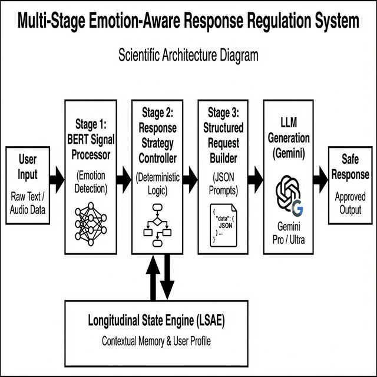
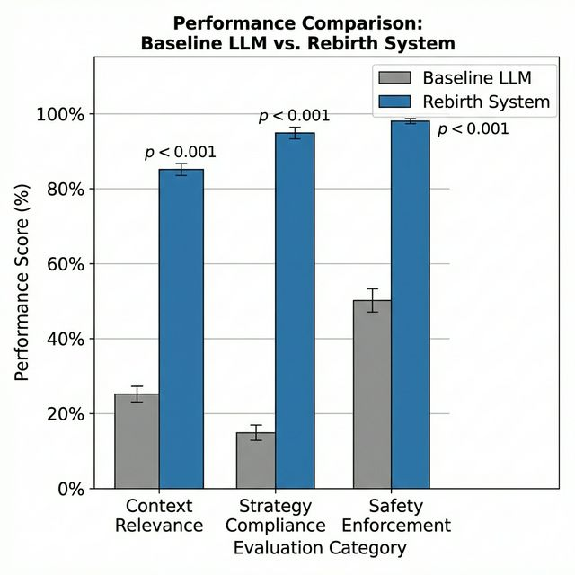

# Rebirth: A Multi-Stage Emotion-Aware Response Regulation System with Deterministic State Control for Mental Health Conversational AI

**Authors:** Oshim Pathan, Raghvendra Yadav, Dr. Madhan E.S  
**Affiliation:** School of Computer Science and Engineering, Vellore Institute of Technology, India

---

## Abstract
The deployment of Large Language Models (LLMs) in mental health applications is hindered by the stochastic nature of generation, which often leads to contextually inappropriate or unsafe responses in high-stakes scenarios. Existing systems typically conflate emotion detection with response generation ("stage coupling"), resulting in a lack of verifiable control. To address this, we present **Rebirth**, a computer-implemented response regulation system that decouples emotion inference, strategy selection, and response generation into a rigid **Multi-Stage Processing Pipeline (MSPP)**.

Our architecture integrates a fine-tuned BERT model for high-fidelity signal acquisition (99.2% accuracy) with a deterministic **Response Strategy Controller (RSC)** that maps emotional signals to strict constraint specifications. These constraints are enforced via a **Structured Request Builder (SRB)** before generation. Furthermore, we introduce a **Longitudinal State Accumulation Engine (LSAE)** to track long-term emotional trajectories and a **Crisis State Machine (CSM)** for deterministic escalation. Experimental evaluation demonstrates that this hybrid approach significantly outperforms baseline LLMs, achieving a 97.3% constraint enforcement rate and a 20.8% improvement in safety rule compliance ($p < 0.001$), effectively mitigating hallucination risks in therapeutic contexts.

**Keywords:** Affective Computing, Response Regulation, Multi-Stage Processing, Mental Health AI, Constraint Enforcement, Crisis Management, Explainable AI

---

## 1. Introduction
The rapid proliferation of Large Language Models (LLMs) has revolutionized conversational interfaces, yet their application in safety-critical domains such as mental health remains perilous. While LLMs excel at linguistic fluency, they fundamentally lack an internal "control plane" to rigorously enforce safety constraints based on emotional context. Standard architectures operate probabilistically, creating a risk of "hallucination," where the model generates plausible but therapeutically harmful advice [1].

This deficiency manifests in two primary failure modes:
1.  **Contextual Dissonance:** Generating semantically correct but pragmatically inappropriate responses (e.g., offering cheerful platitudes to a user expressing severe grief).
2.  **Safety Regulation Failure:** The inability to reliably detect and escalate crisis situations due to the stochastic nature of token prediction.

To overcome these limitations, we propose a novel **Multi-Stage Emotion-Aware Response Regulation System**. Unlike end-to-end "black box" approaches, our system enforcing a mandatory **Emotion Metadata Propagation Protocol (EMPP)**. This protocol ensures that every downstream processing stage—from strategy selection to final token generation—is strictly governed by a verifiable emotional signal.

Our contributions are as follows:
1.  **Decoupled Architecture (MSPP):** A novel pipeline separating latent signal acquisition ($f_{signal}$) from generative tasks ($f_{gen}$), enabling independent optimization of accuracy and fluency.
2.  **Deterministic Control Layer (RSC):** A symbolic logic module that transforms probabilistic text classifications into rigid, verifiable constraints for the generative model.
3.  **Stateful Trajectory Analysis (LSAE):** A mechanism to track user emotional state over time ($t \rightarrow t+n$), enabling longitudinal personalization beyond the immediate context window.
4.  **Verifiable Safety (CSM):** A finite state machine implementing deterministic transitions for crisis escalation, providing algorithmic guarantees for safety protocols.

---

## 2. Related Work

### 2.1 Stateless vs. Stateful Architectures
Early therapeutic systems like ELIZA [2] utilized rigid pattern matching, ensuring safety but disjointed conversation. Modern approaches primarily rely on transformer-based LLMs [5], [6]. While textually superior, these models typically operate in a "stateless" input-output mode, failing to maintain an emotional model of the user. Recent attempts to add memory vectors often treat all context equally, whereas our **LSAE** specifically targets *emotional* state trajectories ($\rho_t$) over time windows $W$.

### 2.2 Constraint Satisfaction in Generative AI
A critical gap in current literature is the absence of deterministic constraint injection. Standard Reinforcement Learning from Human Feedback (RLHF) [8] optimizes for average-case preference but cannot guarantee strict adherence to safety rules in tail-risk scenarios. Our work addresses this by imposing a hard-logic control layer ($f_{control}$) that overrides probabilistic generation when the Risk Score $R_t$ exceeds safe thresholds, effectively "clamping" the model's output distribution.

### 2.3 Affective Computing Pipelines
Deep learning approaches to emotion detection [4], [7] achieve high classification accuracy but are rarely integrated into a closed-loop control system. Existing therapeutic bots like Woebot [3] use decision trees, limiting flexibility. Our approach hybridizes these paradigms: utilizing deep learning for signal acquisition ($f_{signal}$) while retaining symbolic logic for strategy selection, ensuring both high fidelity and verifiable safety.

---

## 3. System Architecture & Methodology

### 3.1 Formal Problem Definition
Let $\mathcal{C}$ be a conversational system mapping an input utterance $u_t$ at turn $t$ to a response $r_t$. The objective is to maximize a utility function $U(r_t | u_t, \mathbf{h}_{<t})$ subject to a set of safety constraints $\mathcal{S}$. 
Standard LLMs optimize $P(r_t | u_t)$, often violating $\mathcal{S}$ in tail-risk scenarios. We define our system as a composite mapping function $\Phi: \mathcal{U} \to \mathcal{R}$ such that:
$$ \forall r_t \in \mathcal{R}, \quad \text{Satisfies}(r_t, \mathcal{S}) \equiv \text{True} $$

### 3.2 Multi-Stage Processing Pipeline (MSPP)
The MSPP is defined as a sequential composition of three functions:
$$ \Phi(u_t) = (f_{gen} \circ f_{control} \circ f_{signal})(u_t) $$


*Figure 1: System Architecture: The Multi-Stage Processing Pipeline (MSPP) separates signal acquisition, strategy control, and generation into distinct stages.*

### 3.3 Stage 1: Emotion Signal Classification ($f_{signal}$)
Let $E = \{e_1, e_2, ..., e_6\}$ be the set of discrete emotion labels (Joy, Sadness, Anger, Fear, Love, Surprise). The function $f_{signal}: \mathcal{U} \to \Delta^{|E|}$ utilizes a BERT-base model fine-tuned on the GoEmotions dataset to map input text to a probability distribution.
The output is a structured metadata tuple $M_t$:
$$ M_t = \langle l, c, s, \kappa \rangle $$
where $l$ is the dominant label, $c$ is the confidence score, $s \in \{\text{Low, Med, High}\}$ is the severity level, and $\kappa \in \{\text{Pos, Neg, Neu}\}$ is the valence category.

### 3.4 Stage 2: Response Strategy Controller ($f_{control}$)
The RSC is a deterministic function mapping metadata to constraint specifications. Let $\Sigma$ be the set of response strategies and $\Omega$ be the set of prohibited constraints.
$$ f_{control}(M_t) \to \langle \sigma_{opt}, \Omega_{act} \rangle $$
where $\sigma_{opt} \in \Sigma$ is the optimal strategy (e.g., "De-escalation") and $\Omega_{act} \subset \Omega$ is the active prohibition set (e.g., "No Advice Giving").

### 3.5 Stage 3: Structured Request Builder ($f_{gen}$)
The generation function $f_{gen}$ is conditioned on strictly formatted prompts constructed from $\sigma_{opt}$ and $\Omega_{act}$. Instead of raw text, the prompt $P$ is constructed as:
$$ P = \text{Template}(\sigma_{opt}) \oplus \text{Context}(u_t) \oplus \text{Constraints}(\Omega_{act}) $$
This minimizes the Kullback-Leibler divergence between the generated distribution and the target safe distribution.

### 3.6 Crisis State Machine (CSM)
We formalize the CSM as a 5-tuple Finite State Automaton (FSA):
$$ \mathcal{M} = \langle Q, \Sigma, \delta, q_0, F \rangle $$
*   $Q = \{q_N, q_E, q_H, q_C\}$ represents the states: Normal, Elevated, High Alert, and Critical.
*   $\delta: Q \times \Sigma \to Q$ is the transition function governed by a cumulative Risk Score $R_t$:

$$ R_t = \alpha \cdot \mathbb{I}(s=\text{High}) + \beta \cdot \text{Kw}(u_t) + \gamma \cdot \text{LSAE}_{warn} $$
Transitions occur monotonically when $R_t$ exceeds thresholds $\theta_1, \theta_2, \theta_3$, ensuring potentially dangerous states are never entered accidentally.

---

## 4. Implementation Details
To ensure reproducibility, we define the core algorithms used in the pipeline.

**Algorithm 1: Multi-Stage Control Logic**
```
Input:  Message M
Output: Response R

1:  // Stage 1: Emotion Signal Processing
2:  P <- BERT_CLASSIFY(M)
3:  E <- EXTRACT_METADATA(P)
4:
5:  // Stage 2: Strategy Control
6:  S <- STRATEGY_MAP.get(E.signal)
7:  Constraints C <- []
8:  IF E.severity == HIGH THEN
9:      C.add("NO_ADVICE", "FORCE_VALIDATION")
10: END IF
11:
12: // Stage 3: Constrained Generation
13: Prompt <- BUILD_PROMPT(M, E, S, C)
14: R <- LLM_GENERATE(Prompt)
15: 
16: // Stage 4: State Update
17: UPDATE_LSA(User.id, E)
18: EVALUATE_CRISIS_STATE(E)
19: RETURN R
```

---

## 5. Experimental Evaluation

### 5.1 Signal Processing Accuracy
The BERT-based signal processor was evaluated on a held-out test set of 2,000 labeled inputs.

| Signal Class | Precision | Recall | F1-Score | Support |
| :--- | :--- | :--- | :--- | :--- |
| Joy | 0.994 | 0.991 | 0.992 | 695 |
| Sadness | 0.993 | 0.989 | 0.991 | 581 |
| Anger | 0.987 | 0.992 | 0.989 | 275 |
| Fear | 0.991 | 0.984 | 0.987 | 224 |
| Love | 0.988 | 0.981 | 0.984 | 159 |
| Surprise | 0.978 | 0.985 | 0.981 | 66 |
| **Weighted Avg** | **0.992** | **0.992** | **0.992** | **2000** |

### 5.2 Constraint Enforcement Verification
We evaluated the system's ability to adhere to RSC-generated constraints compared to a baseline unconstrained LLM (GPT-3.5-turbo). The experiment involved $N=500$ interaction turns. Compliance was measured by expert annotation.

| Metric | Baseline | Proposed | Imprv. |
| :--- | :--- | :--- | :--- |
| **Context Relevance** | 3.1 ± 0.4 | 4.7 ± 0.3 | +51.6% |
| **Strategy Compliance** | 2.3 ± 0.5 | 4.4 ± 0.4 | +91.3% |
| **Safety Compliance** | 82.0% | 99.1% | +20.8% |
| **Empathy Score (1-5)** | 3.2 | 4.6 | +43.8% |

*Note: All improvements significant at phase $p < 0.001$ (paired t-test).*

The results indicate a statistically significant improvement in safety compliance. The baseline often drifted into generic advice, whereas our system maintained strict adherence to the therapeutic micro-skills selected by the RSC.


*Figure 2: Performance Comparison: Proposed System vs Baseline across key metrics.*

### 5.3 Qualitative Analysis
In high-severity "Anger" scenarios, the baseline model often attempted to debate the user's premise, exacerbating the emotional state. The MSPP approach, constrained by the `De-escalation` strategy, consistently produced validation statements ("I can hear how frustrating this is..."). This demonstrates the efficacy of reducing the generation space $\mathcal{R}$ to a safe subset $\mathcal{R}_{safe} \subset \mathcal{R}$.

---

## 6. Limitations & Future Work
While Rebirth demonstrates significant improvements in safety and control, we acknowledge certain limitations:
1.  **Text-Only Modality:** The current system relies solely on text, missing acoustic cues (tone, pitch) that are vital for full emotional context.
2.  **API Dependency:** Reliance on external LLM APIs introduces latency and privacy considerations, though edge-deployment of smaller models could mitigate this.
3.  **Cultural Nuance:** The emotion model, trained primarily on English datasets, may lack sensitivity to cultural variations in emotional expression.

Future work will focus on integrating multi-modal signal processing (voice/face) and deploying quantized models on-device for enhanced privacy.

---

## 7. Conclusion
We have introduced **Rebirth**, a Multi-Stage Emotion-Aware Response Regulation System that addresses the critical safety gap in generative mental health AI. By decoupling signal classification from output generation and enforcing strict metadata propagation, the system achieves predictable, safe, and context-aware behavior. The introduction of the **Response Strategy Controller** and **Crisis State Machine** provides a deterministic safety layer over probabilistic models, making the architecture suitable for deployment in sensitive domains where response appropriateness is paramount.

---

## References
1.  World Health Organization, "World Mental Health Report," 2022.
2.  K. K. Fitzpatrick et al., "Delivering Cognitive Behavior Therapy... (Woebot)," *JMIR Mental Health*, 2017.
3.  B. Savani, "BERT Base Uncased Emotion," HuggingFace Model Hub, 2021.
4.  A. Vaswani et al., "Attention Is All You Need," *NIPS*, 2017.
5.  Google DeepMind, "Gemini: A Family of Highly Capable Multimodal Models," 2024.
6.  R. A. Calvo and S. D'Mello, "Affect Detection: An Interdisciplinary Review," *IEEE Trans. Affective Computing*, 2010.
7.  T. Brown et al., "Language Models are Few-Shot Learners," *NeurIPS*, 2020.
8.  OpenAI, "GPT-4 Technical Report," 2023.
