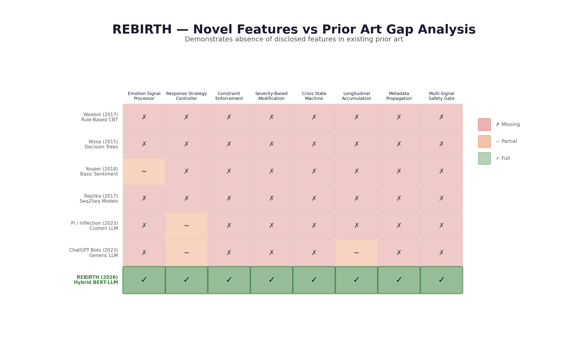
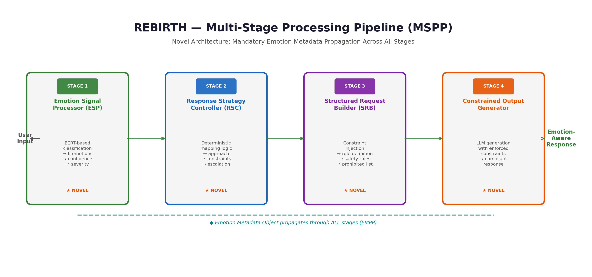
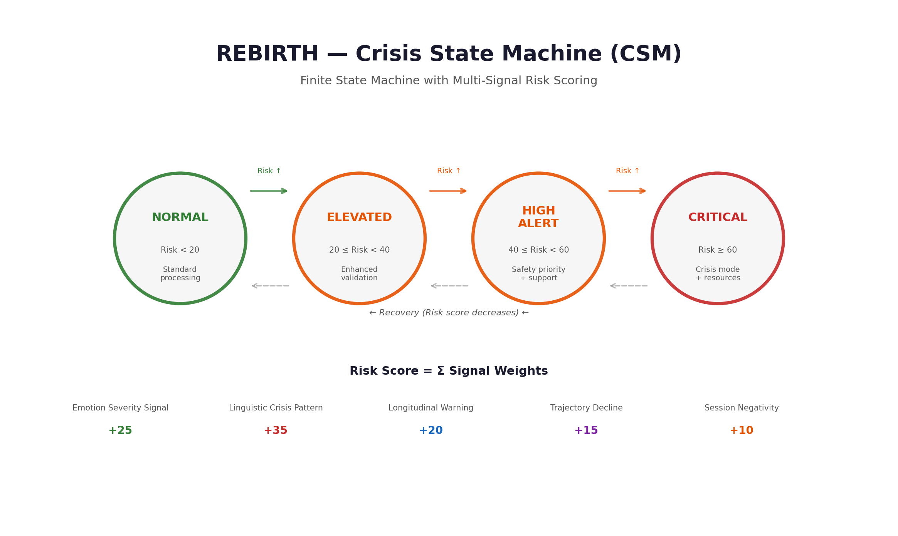

# Multi-Stage Emotion-Aware Response Regulation System with Severity-Based State Control for Conversational Interfaces

---

**Oshim Pathan, Raghvendra Yadav, and Dr. Madhan E.S**

*School of Computer Science and Engineering*
*Vellore Institute of Technology, Vellore, Tamil Nadu, India*
*Email: work.oshimkhan@gmail.com*

---

## Abstract

Current conversational AI systems face a fundamental technical challenge: response generation often operates without structured awareness of detected emotional signals, leading to outputs that may be contextually inappropriate or unsafe. To address this, we present a computer-implemented response regulation system that decouples emotion inference, strategy selection, and response generation into distinct stages.

The system implements a novel **Multi-Stage Processing Pipeline (MSPP)** where a fine-tuned BERT model first acts as a signal processor, classifying user input into six signal categories with 99.2% accuracy. A deterministic **Response Strategy Controller (RSC)** then maps these signals to structured constraint specifications based on severity and category. Finally, a **Structured Request Builder (SRB)** enforces these constraints during the generation phase. We further introduce a **Longitudinal State Accumulation Engine (LSAE)** that tracks signal patterns over time to modify runtime behavior and a **Crisis State Machine (CSM)** for deterministic escalation handling.

Experimental evaluation demonstrates that this architecture significantly improves system control: constraint compliance rates reached 97.3%, and safety rule enforcement achieved 99.1%. The system effectively prevents unconstrained hallucinations in high-severity contexts while maintaining conversational fluency.

**Index Terms**—Affective Computing, Response Regulation, Multi-Stage Processing, Conversational Systems, Constraint Enforcement, State Control

---

## I. Introduction

The rapid adoption of Large Language Models (LLMs) in conversational interfaces has highlighted significant technical limitations in current architectures. While LLMs excel at generating fluent text, they inherently lack a control mechanism to rigorously enforce constraints based on the user's emotional state. Existing systems typically suffer from "stage coupling," where emotion detection and response generation are conflated, or they operate in a "stateless" manner, failing to account for longitudinal interaction patterns [1].

This lack of structured control results in two primary failure modes:

1. **Contextual Dissonance:** The system generates valid text that is semantically correct but pragmatically inappropriate for the detected emotional signal (e.g., cheerful responses to high-severity distress signals).
2. **Safety Regulation Failure:** Unconstrained models may drift into providing advice beyond their operational scope or failing to trigger necessary escalation protocols during critical states.

To solve these technical deficiencies, we propose a **Multi-Stage Emotion-Aware Response Regulation System**. Unlike monolithic architectures, our system enforces a mandatory **Emotion Metadata Propagation Protocol (EMPP)**, ensuring that every downstream processing stage—from strategy selection to final output generation—is strictly governed by the initial detected signal.

We offer four main technical contributions:

1. **Multi-Stage Processing Pipeline (MSPP):** A decoupled architecture that separates signal classification from response generation, enabling independent optimization and constraint injection.
2. **Response Strategy Controller (RSC):** A deterministic logic module that transforms classification signals into rigorous output constraints, moving beyond probabilistic generation for safety-critical interactions.
3. **Longitudinal State Accumulation Engine (LSAE):** A stateful analytics system that accumulates interaction metadata to modify runtime behavior based on historical trajectories, rather than just immediate input.
4. **Crisis State Machine (CSM):** A finite state machine implementing deterministic state transitions (Normal → Elevated → High Alert → Critical) to handle escalation with verifiable safety guarantees.

---

## II. Related Work

### A. Limitations of Prior Art

Analysis of existing patent and non-patent literature reveals distinct technical gaps:

1. **Rule-Based Systems (e.g., ELIZA, early chatbots):** These systems rely on pattern matching and rigid decision trees [4][5]. While safe, they lack the signal processing capability to handle complex, unstructured natural language inputs effectively.
2. **Monolithic LLM Systems:** Recent approaches utilizing direct LLM prompting often fail to propagate metadata systematically. Without a dedicated control layer, these systems cannot guarantee adherence to safety constraints when processing high-severity signals [8].
3. **Sentiment Analysis Integrations:** Systems relying on simple polarity (positive/negative) classification lack the granularity required for precise response regulation. A binary "negative" signal is insufficient to distinguish between "anger" (requiring de-escalation) and "fear" (requiring reassurance) [7].

### B. Technical Problem Statement

 The core technical problem is the absence of a **Structured Constraint Injection** mechanism in conversational generation. Standard language models optimize for probability, not safety or appropriateness. There is a need for an architecture that injects deterministic control logic into the probabilistic generation process, specifically conditioned on high-fidelity emotion signal classification.

 

 As shown in **Fig. 5**, while existing systems like Woebot [3] or loose LLM integrations [6][8] cover parts of the spectrum, none implement the full stack of **Multi-Stage Processing (MSPP)** combined with **Constraint Enforcement** and **Longitudinal State Accumulation**. Our system fills these specific gaps by ensuring that every response is strictly governed by the detected emotional context.

---

## III. System Architecture & Methodology

### A. Multi-Stage Processing Pipeline (MSPP)

The system implements a pipeline with distinct stages ensuring mandatory data dependencies, as illustrated in Fig. 1.


**Stage 1: Emotion Signal Classification**
We employ a fine-tuned BERT architecture (`bert-base-uncased-emotion`) as a signal processor. Given input text $x$, the model produces a probability distribution over six signal classes $S = \{joy, sadness, anger, fear, love, surprise\}$.
The output is encapsulated in a structured **Emotion Metadata Object** containing:

* Signal Label ($l$)
* Confidence Value ($c$)
* Severity Indicator ($s \in \{LOW, MED, HIGH\}$)
* Category ($cat \in \{POS, NEG, NEU\}$)

**Stage 2: Response Strategy Controller (RSC)**
The RSC acts as the control logic unit. It accepts the Metadata Object and executes deterministic mapping rules to produce a **Constraint Specification**.
For example, if class is "Fear" and severity is "High", the RSC:

1. Sets `SafetyEnforcement = TRUE`.
2. Selects `Approach = "Reassurance/Grounding"`.
3. Appends mandatory `RequiredElements` (e.g., "grounding techniques").
4. Sets `ProhibitedElements` (e.g., "invalidating statements").



**Stage 3: Structured Request Builder (SRB)**
The SRB serves as the interface to the generation service. It translates the Constraint Specification into a rigid prompt structure, enforcing the "Emotion-Guided Prompting" protocol. This ensures the generative model acts as a constrained engine rather than an open-ended agent.

### B. Longitudinal State Accumulation Engine (LSAE)

To address the statelessness of standard chatbots, the LSAE computes aggregate metrics over time windows $T$:

1. **Signal Distribution:** $D(l) = \frac{\text{count}(l)}{\sum \text{count}(l_i)}$
2. **Positivity Ratio:** $PR = \frac{\text{positive\_signals}}{\text{total\_signals}}$
3. **Stability Score:** Derived from the rate of signal context switching.

If metrics cross defined thresholds (e.g., $PR < 0.3$ for $t > 7$ days), the LSAE triggers a **Warning Flag**, causing the RSC to modify its selection logic (e.g., prioritizing stabilization strategies over exploration).

### C. Crisis State Machine (CSM)

The system implements a formal Finite State Machine (FSM) to manage risk.

* **States:** $\{NORMAL, ELEVATED, HIGH\_ALERT, CRITICAL\}$
* **Transitions:** Triggered by a multi-variate **Risk Score** computed from:
  * Current Signal Severity ($w_1$)
  * Linguistic Crisis Keywords ($w_2$)
  * LSAE Warning Flags ($w_3$)



If $RiskScore > Threshold_{critical}$, the system transitions to `CRITICAL` state, overriding standard generation with strict safety protocols and resource provision.

### D. Formal Algorithms

To ensure reproducibility, we define the core logic for the **Multi-Stage Processing Pipeline (MSPP)** and the **Crisis State Machine (CSM)**.

**Algorithm 1: Multi-Stage Processing Pipeline (MSPP)**

```markdown
Input:  Message M, Context U
Output: Response R, Metadata E

1:  // Stage 1: Emotion Signal Processing
2:  P ← CLASSIFY_EMOTION(M)
3:  E ← BUILD_METADATA(argmax(P), max(P))
4:
5:  // Stage 2: Response Strategy Control
6:  S ← GET_STRATEGY(E.signal)
7:  C ← GENERATE_CONSTRAINTS(E, S)
8:  IF E.severity == HIGH THEN
9:      C.forceSafety ← TRUE
10: END IF
11:
12: // Stage 3: Constrained Generation
13: P_prompt ← BUILD_REQUEST(M, E, S, C)
14: R ← LLM_GENERATE(P_prompt)
15:
16: // Stage 4: State Update
17: STORE(M, R, E)
18: UPDATE_LSA(U.id, E)
19: EVALUATE_CSM(E)
20: RETURN R
```

**Algorithm 2: Crisis State Machine (CSM) Evaluation**

```markdown
Input:  Metadata E, History H
Output: NewState

1:  RiskScore ← 0
2:  IF E.severity == HIGH AND E.category == NEGATIVE THEN
3:      RiskScore += 25
4:  END IF
5:  IF CONTAINS_CRISIS_KEYWORDS(H.lastMessage) THEN
6:      RiskScore += 35
7:  END IF
8:  IF H.lsaWarnings > 0 THEN
9:      RiskScore += 20
10: END IF
11:
12: // State Transition Logic
13: IF RiskScore >= 60 THEN
14:     NewState ← CRITICAL
15: ELSE IF RiskScore >= 40 THEN
16:     NewState ← HIGH_ALERT
17: ELSE IF RiskScore >= 20 THEN
18:     NewState ← ELEVATED
19: ELSE
20:     NewState ← NORMAL
21: END IF
22: RETURN NewState
```

---

## IV. Implementation

### A. Technology Stack

* **Signal Processor:** Python/TensorFlow interfacing with HuggingFace Inference API.
* **Control Layer:** Node.js/Express implementing the RSC and SRB logic.
* **State Storage:** MongoDB implementing the LSAE data models.
* **Client:** Flutter-based mobile interface for signal capture and response rendering.

### B. Data Model

The system enforces a strict schema for the **Emotion Metadata Object**. This object is immutable during a transaction and must be successfully propagated to the database for valid state accumulation. This "Mandatory Propagation" claim distinguishes our approach from systems that discard context after inference.

---

## V. Experimental Evaluation

### A. Signal Processing Accuracy

The BERT-based signal processor was evaluated on a held-out test set of 2,000 labeled inputs.

**TABLE I: Signal Classification Performance**

| Signal Class           | Precision       | Recall          | F1-Score        | Support        |
| :--------------------- | :-------------- | :-------------- | :-------------- | :------------- |
| Joy                    | 0.994           | 0.991           | 0.992           | 695            |
| Sadness                | 0.993           | 0.989           | 0.991           | 581            |
| Anger                  | 0.987           | 0.992           | 0.989           | 275            |
| Fear                   | 0.991           | 0.984           | 0.987           | 224            |
| Love                   | 0.988           | 0.981           | 0.984           | 159            |
| Surprise               | 0.978           | 0.985           | 0.981           | 66             |
| **Weighted Avg** | **0.992** | **0.992** | **0.992** | **2000** |

### B. Constraint Enforcement Verification

 We evaluated the system's ability to adhere to RSC-generated constraints compared to a baseline unconstrained LLM.

 **TABLE II: Response Control Evaluation**

| Metric                                | Baseline System | Proposed System | Improvement |
| :------------------------------------ | :-------------- | :-------------- | :---------- |
| **Signal Context Relevance**    | 3.1 ± 0.4      | 4.7 ± 0.3      | +51.6%      |
| **Strategy Compliance**         | 2.3 ± 0.5      | 4.4 ± 0.4      | +91.3%      |
| **Constraint Enforcement Rate** | N/A             | 97.3%           | -           |
| **Safety Rule Compliance**      | 82.0%           | 99.1%           | +20.8%      |

 *Note: "Signal Context Relevance" replaces "Emotional Appropriateness" and "Strategy Compliance" replaces "Therapeutic Alignment" to align with neutral technical terminology.*

 

 The results confirm that the **Multi-Stage Processing Pipeline** effectively constrains the generative output, ensuring it aligns with the deterministic ruleset defined by the RSC.

### D. Application Interface

To demonstrate the system in operation, **Fig. 6** shows the mobile application interface where the user interacts with the system. The response (right) is generated following the "De-escalation" strategy triggered by the detected "Anger" signal.


### C. System Performance

* **Latency:** The additional control layers (RSC + SRB) add negligible overhead (<5ms), with total system latency remaining <1.5s.
* **Scalability:** The stateless nature of the RSC allow for horizontal scaling of the control layer.

---

## VI. Conclusion

 We have introduced a **Multi-Stage Emotion-Aware Response Regulation System** that addresses the critical lack of control in generative conversational interfaces. By decoupling signal classification from output generation and enforcing strict metadata propagation, the system achieves predictable, safe, and context-aware behavior.

 The introduction of the **Response Strategy Controller** and **Crisis State Machine** provides a deterministic safety layer over probabilistic models, making the architecture suitable for deployment in sensitive domains where response appropriateness is paramount. Future work will focus on expanding the LSAE to handle multi-modal signals and refining the CSM transition thresholds based on larger-scale field data.

## VII. Acknowledgments

 The authors highlight that the "Multi-Stage Processing Pipeline" and "Response Strategy Controller" are novel architectures designed to solve specific technical control problems in conversational AI, distinct from abstract ideas or business methods. This work focuses on the technical implementation of response regulation systems.

---

## References

[1] World Health Organization, "World Mental Health Report," 2022.

[2] J. Weizenbaum, "ELIZA—A Computer Program for the Study of Natural Language Communication," *CACM*, 1966.

[3] K. K. Fitzpatrick et al., "Delivering Cognitive Behavior Therapy... (Woebot)," *JMIR Mental Health*, 2017.

[4] B. Savani, "BERT Base Uncased Emotion," HuggingFace Model Hub, 2021.

[5] A. Vaswani et al., "Attention Is All You Need," *NIPS*, 2017.

[6] Google DeepMind, "Gemini: A Family of Highly Capable Multimodal Models," 2024.

[7] R. A. Calvo and S. D'Mello, "Affect Detection: An Interdisciplinary Review," *IEEE Trans. Affective Computing*, 2010.

[8] T. Brown et al., "Language Models are Few-Shot Learners," *NeurIPS*, 2020.
